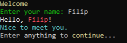

# Single executable welcome program #

This is simple "Welcome" application written in C# compiled to self contained executable.

Resulting executable will contain all libraries it depends on and it will not even need .NET Core to be installed on the machine.



## Steps ##

Clone this repository.

```
git clone https://github.com/zoltraks/welcome-csharp-single.git
```

To enable building self contained single executable, following settings were set in **.csproj**.

```xml
<PublishTrimmed>true</PublishTrimmed>
<PublishReadyToRun>true</PublishReadyToRun>
<PublishSingleFile>true</PublishSingleFile>
<PublishReadyToRunShowWarnings>false</PublishReadyToRunShowWarnings>
```

 - *PublishTrimmed* indicates to remove all the dotnet dependencies that are not being used by our code. When doing this in a real world application, it is very important to test it afterwards in case some dependency that is referenced by code (for example using reflection) is being trimmed as well.
 
 - *PublishReadyToRun* it is supposed to make the start time of our application faster, but in the process it will make the binary heavier.

## Build ##

```
dotnet publish -r win-x64 -c Release
```

Single file **Welcome.exe** will have ~53MB size. 

You might be wondering if it will work for Linux. Yes, it will. :-)

```
dotnet publish -r linux-x64 -c Release
```

For lightweight distributions like [https://alpinelinux.org/](Alpine) (which is very popular for docker containers) you may want to use **linux-musl-x64**. For other targets read more about RID [https://docs.microsoft.com/en-us/dotnet/core/rid-catalog](here).
```
dotnet publish -r linux-musl-x64 -c Release
```

Executable file **Welcome** will be around ~45MB size.

But if you see this error, you might need to change *PublishReadyToRun* to *false*.

```
C:\Program Files\dotnet\sdk\3.1.100\Sdks\Microsoft.NET.Sdk\targets\Microsoft.NET.Publish.targets(273,5): error NETSDK1095: Optimizing assemblies for performance is not supported for the selected target platform or architecture. Please verify you are using a supported runtime identifier, or set the PublishReadyToRun property to false. [C:\PROJECT\HUB\welcome-csharp-single\Welcome.csproj]     
```

## Warp ##

Build single executable using **warp** tool for **dotnet** command.

```
dotnet warp
```

Output binary **Welcome.exe** will be ~24MB.

If you see following error, that means **warp** tool is needed to be installed first.

```
Could not execute because the specified command or file was not found.
Possible reasons for this include:
  * You misspelled a built-in dotnet command.
  * You intended to execute a .NET Core program, but dotnet-warp does not exist.
  * You intended to run a global tool, but a dotnet-prefixed executable with this name could not be found on the PATH.
```

```
dotnet tool install -g dotnet-warp
```

Warp is an excelent utility that allows creating self-contained single binary applications.

https://github.com/dgiagio/warp

## Extra ##

If you are interested only on one target platform, i.e. 64-bit, you may add this setting to your **.csproj** file.

```xml
<RuntimeIdentifier>win-x64</RuntimeIdentifier>
```

This might also be interesting.

https://devandchill.com/posts/2019/06/net-core-3.0-publish-single-file-binary-on-alpine-container/
